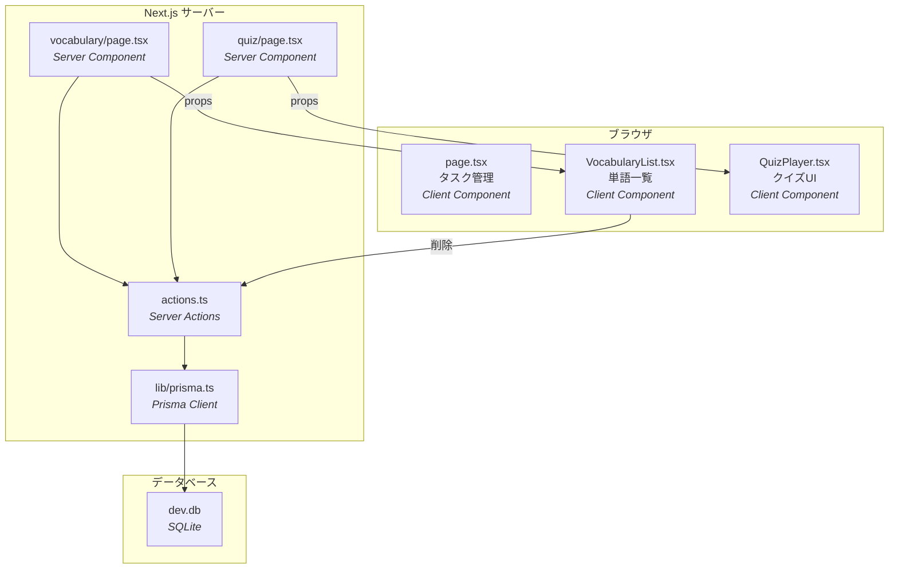
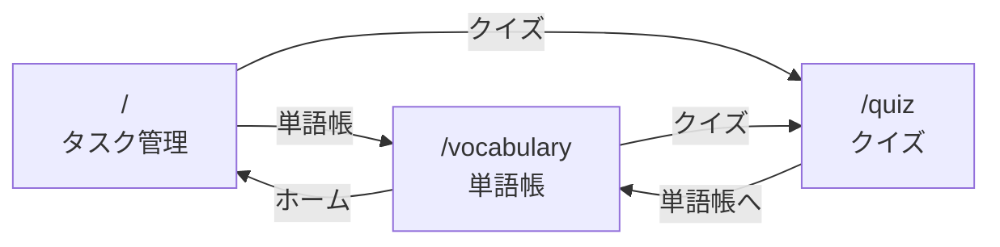

# AIX Platform - TOEIC学習アプリケーション

Next.js（App Router）で構築した、TOEIC学習のための多機能Webアプリケーションです。  
タスク管理、単語帳、クイズの3画面を備え、Prisma + SQLite でデータを永続化しています。

---

## 画面一覧

| パス | 画面名 | 説明 |
|------|--------|------|
| `/` | タスク管理ダッシュボード | タスクの追加・完了・削除を管理 |
| `/vocabulary` | TOEIC単語帳 | 英単語と意味を登録・一覧表示・削除 |
| `/quiz` | クイズ画面 | 登録済み単語からランダムに10問出題 |

---

## 技術スタック

| カテゴリ | 技術 | バージョン |
|----------|------|-----------|
| フレームワーク | Next.js (App Router) | 16.1.6 |
| UI ライブラリ | React | 19.2.3 |
| スタイリング | Tailwind CSS | 4.x |
| 言語 | TypeScript | 5.x |
| ORM | Prisma | 6.19.2 |
| データベース | SQLite | - |

---

## アーキテクチャ



---

## 画面遷移



---

## ディレクトリ構成

```
aix-platform/
├── app/
│   ├── layout.tsx              # 共通レイアウト
│   ├── globals.css             # Tailwind CSS 読み込み
│   ├── page.tsx                # / タスク管理ダッシュボード
│   ├── lib/
│   │   └── prisma.ts           # Prisma Client シングルトン
│   ├── vocabulary/
│   │   ├── page.tsx            # /vocabulary Server Component
│   │   ├── actions.ts          # Server Actions (CRUD)
│   │   ├── VocabularyList.tsx  # Client Component (一覧/削除)
│   │   └── README.md
│   └── quiz/
│       ├── page.tsx            # /quiz Server Component
│       ├── QuizPlayer.tsx      # Client Component (クイズUI)
│       └── README.md
├── prisma/
│   ├── schema.prisma           # モデル定義
│   ├── seed.ts                 # 初期データ投入スクリプト
│   ├── dev.db                  # SQLite データベース
│   └── migrations/             # マイグレーション履歴
├── docs/
│   └── 解説資料.md
├── package.json
├── .env                        # DATABASE_URL
└── tsconfig.json
```

---

## セットアップ

### 必要な環境

- Node.js 20 以上
- npm

### インストール & 起動

```bash
# リポジトリをクローン
git clone <repository-url>
cd aix-platform

# 依存関係のインストール
npm install

# データベースのセットアップ
npx prisma migrate dev    # マイグレーション実行（dev.db 作成）
npx prisma db seed        # 初期データ投入（TOEIC単語 10件）

# 開発サーバー起動
npm run dev
```

ブラウザで http://localhost:3000 にアクセスしてください。

---

## データベース

### Word モデル

| カラム | 型 | 説明 |
|--------|------|------|
| `id` | Int (自動採番) | 主キー |
| `english` | String | 英単語 |
| `japanese` | String | 日本語の意味 |
| `createdAt` | DateTime (自動設定) | 作成日時 |

### よく使うコマンド

```bash
npx prisma migrate dev     # マイグレーション実行
npx prisma db seed         # シードデータ投入
npx prisma studio          # GUI でデータベース閲覧
npx prisma generate        # Prisma Client 再生成
```

---

## 設計のポイント

| 設計方針 | 説明 |
|----------|------|
| **Server / Client Component 分離** | データ取得は Server Component、インタラクションは Client Component で役割分離 |
| **Server Actions による API レス設計** | REST API を作らず、Server Actions でフォーム処理を完結 |
| **Prisma による型安全な DB 操作** | `schema.prisma` から型が自動生成され、タイプミスをコンパイル時に検出 |
| **Prisma Client シングルトン** | 開発時のホットリロードで DB 接続が増殖しないようグローバルキャッシュ |

---

## ドキュメント

| ファイル | 内容 |
|----------|------|
| [`docs/仕様書.md`](docs/仕様書.md) | 画面構成・データ永続化・DB構成の詳細仕様 |
| [`docs/使用する技術の説明.md`](docs/使用する技術の説明.md) | 各技術の解説（Rails エンジニア向け比較あり） |
| [`docs/アーキテクチャ図.md`](docs/アーキテクチャ図.md) | Mermaid によるシステム構成図・データフロー図 |
| [`docs/作業進捗一覧.md`](docs/作業進捗一覧.md) | フェーズ別の開発進捗 |
| [`aix-platform/docs/解説資料.md`](aix-platform/docs/解説資料.md) | プロジェクト内の詳細解説（初学者〜上級者向け） |

---

## ライセンス

Private
