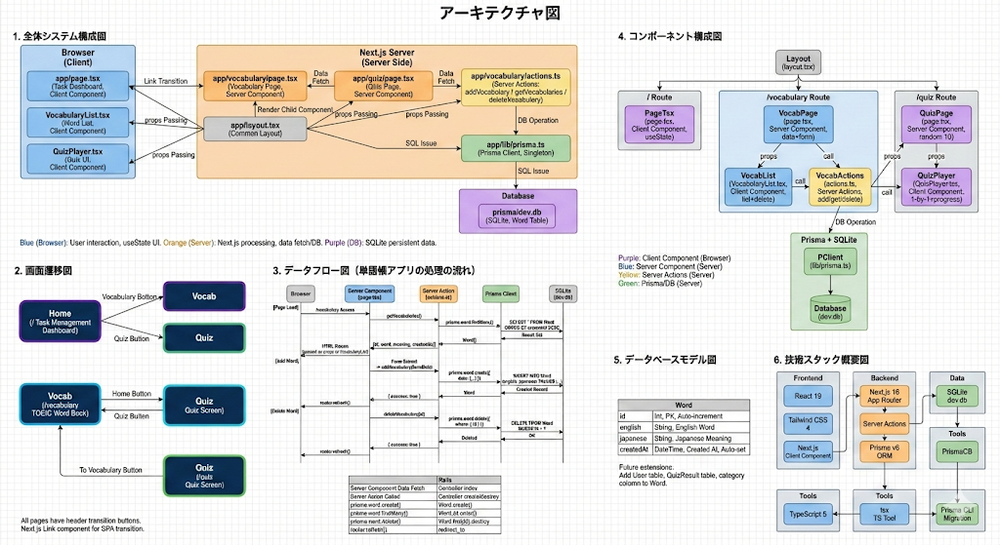
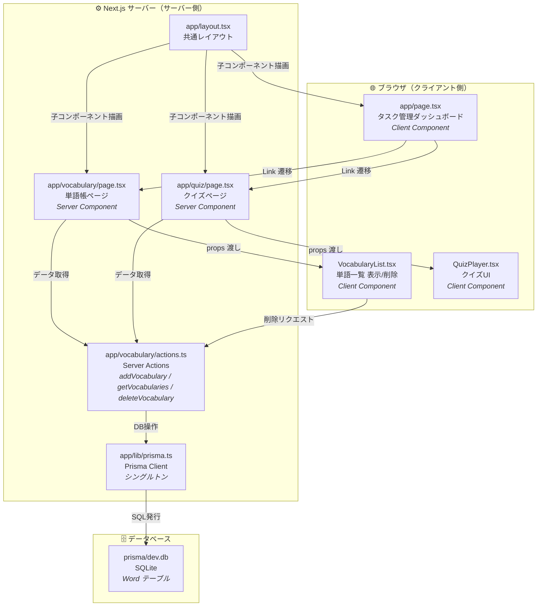
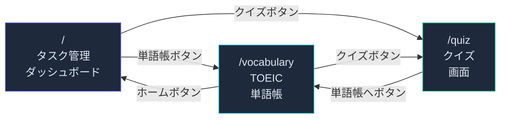
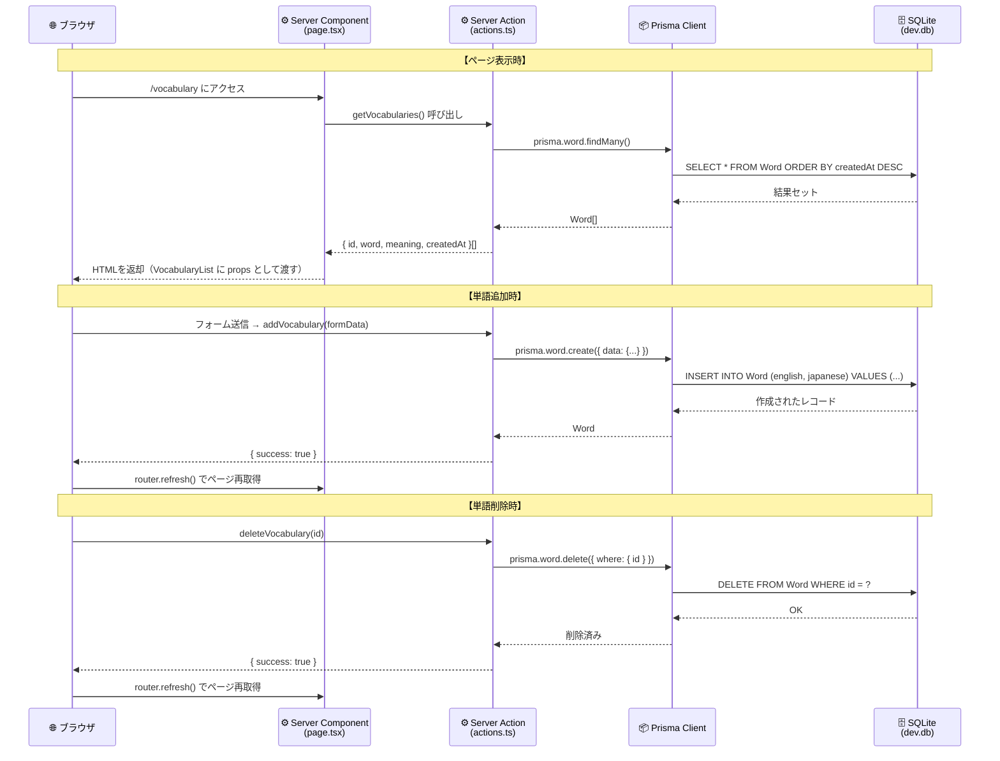
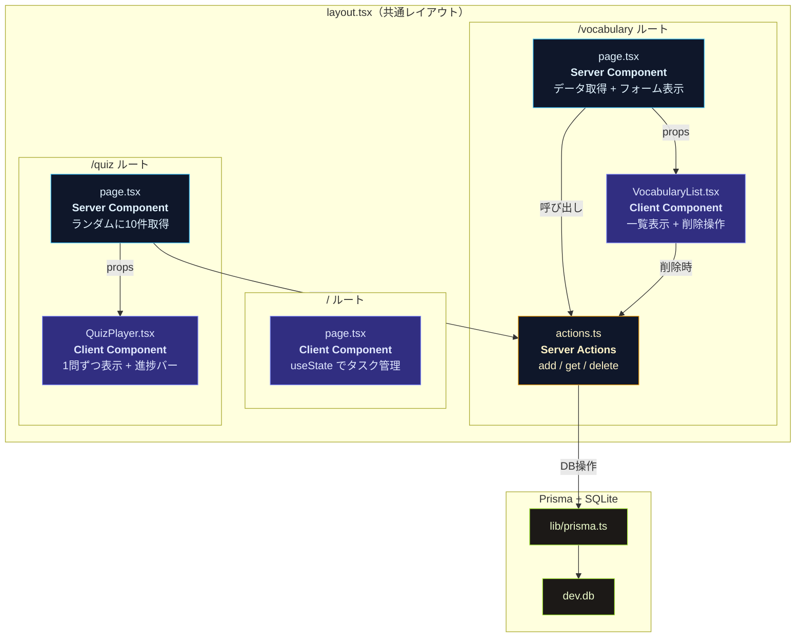
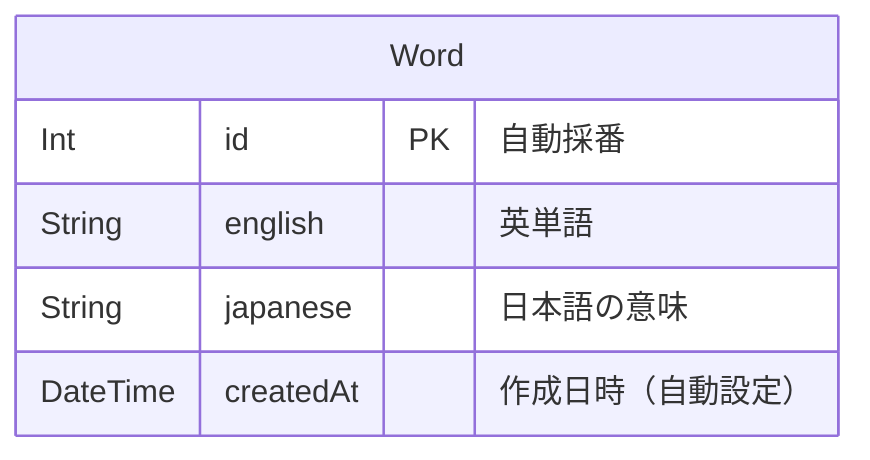
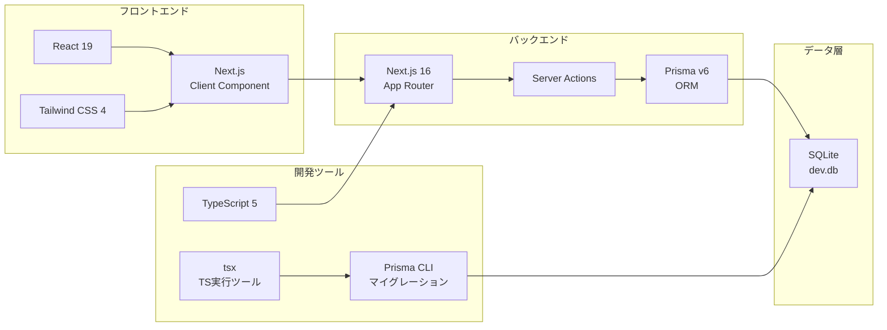

## アーキテクチャ図

このドキュメントでは、aix-platform の全体像を図で解説します。  
図は Mermaid 記法で記述しています（GitHub / VS Code / Cursor で表示可能）。

---

### システム構成図（全体概要）

以下の図は、アプリ全体の構成を1枚にまとめたものです。  
各セクション（1〜6）の詳細は後述の Mermaid 図で確認できます。

**図の構成:**
| セクション | 内容 |
|---|---|
| 1. 全体システム構成図 | ブラウザ・サーバー・DBの3層構成 |
| 2. 画面遷移図 | Home / Vocab / Quiz 間の遷移 |
| 3. データフロー図 | ページ読み込み・単語追加・削除の処理の流れ |
| 4. コンポーネント構成図 | 各ルートのコンポーネントと Server/Client の区分 |
| 5. データベースモデル図 | Word テーブルのスキーマ |
| 6. 技術スタック概要図 | 使用しているフレームワーク・ライブラリ一覧 |

---

### 1. 全体システム構成図

ブラウザ（Client Component）、Next.js サーバー（Server Component / Server Actions）、
データベース（SQLite）の3層構成です。

**読み方:**
- **青の上段（ブラウザ）**: ユーザーが直接操作する部分。`useState` でUIの状態管理。
- **中段（サーバー）**: Next.js が処理する部分。データ取得やDB操作を担当。
- **下段（DB）**: SQLite ファイルにデータが永続保存される。

---

### 2. 画面遷移図

3つの画面が相互にリンクで遷移できます。

**ポイント:**
- 全てのページのヘッダーに他画面への遷移ボタンがある
- Next.js の `Link` コンポーネントで SPA 遷移（ページ全体の再読み込みなし）

---

### 3. データフロー図（単語帳アプリの処理の流れ）

ユーザー操作からDB保存・取得までの一連の流れを時系列で示します。

**Railsとの対比:**
| この図の処理 | Rails での相当処理 |
|---|---|
| Server Component がデータ取得 | Controller の `index` アクション |
| Server Action が呼ばれる | Controller の `create` / `destroy` |
| `prisma.word.create()` | `Word.create(...)` |
| `prisma.word.findMany()` | `Word.all.order(created_at: :desc)` |
| `prisma.word.delete()` | `Word.find(id).destroy` |
| `router.refresh()` | `redirect_to` |

---

### 4. コンポーネント構成図

各ルートで使われるコンポーネントの役割と、Server/Client の区分を示します。

**色の意味:**
| 色 | 区分 | 実行場所 |
|---|---|---|
| 紫 | Client Component | ブラウザ |
| 青 | Server Component | サーバー |
| 黄 | Server Actions | サーバー |
| 緑 | Prisma / DB | サーバー |

---

### 5. データベースモデル図

現在のDBスキーマを示します。

**今後の拡張例:**
- `User` テーブルを追加してユーザー管理
- `QuizResult` テーブルを追加して正解率の記録
- `Word` に `category` カラムを追加して分類機能

---

### 6. 技術スタック概要図

